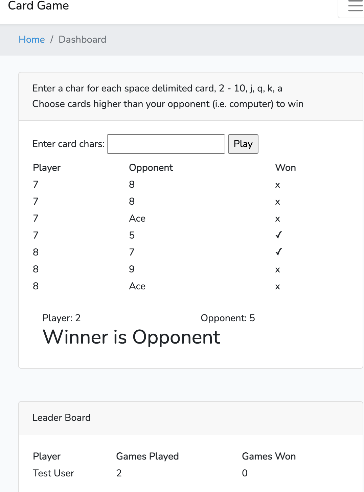

# Card Lame Game
Boilerplate to create card games.
This simple variant of Liar's Poker challenges you to choose
up to 13 cards that exceed random draws from computer opponent



## Requirements
* Tested on PHP 7.4; v7.3 should also work, but not yet v8
* Tested on Node.js v14 lts. v10+ should work

## Optional
* Database, such as MariaDB
  * update .env and see comment at bottom of DashboardController.php
```bash
php artisan migrate`
php artisan db:seed
```

Ships out of the box on working sqlite

## Install
Place this in a web server directory. Alternately, you should be able to 
run `php artisan serve`

* cd into project directory
```bash
cp .env.example .env
composer install
yarn        # alternately `npm i`
yarn run development
php artisan key:genrate
```

open your web directory in your browser (or artisan serve)
Example: http://localhost/

## Demo Credentials
**User:** user@user.com  
**Password:** secret

### Optional Login
**Admin:** admin@admin.com  
**Password:** secret

Admin not actively used by Card Lame

### Detailed Documentation
[Click here for developer documentation](http://laravel-boilerplate.com)

### License
MIT: [http://anthony.mit-license.org](http://anthony.mit-license.org)
